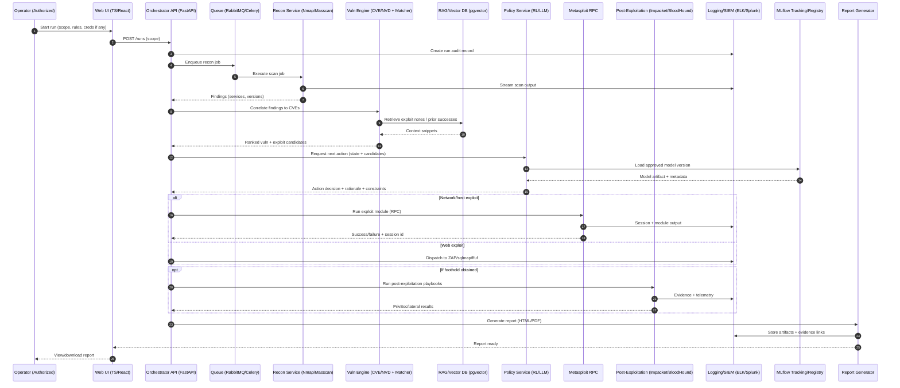

# UML-style Execution Diagrams (Mermaid) for the Automated Pentesting + ML/MLOps Framework

This artifact contains UML-style diagrams (as Mermaid) showing **how each step executes** and **which tools are used by which module/phase**. Mermaid diagrams can be rendered directly in GitHub Markdown and many Markdown viewers. [web:123][web:116]

---

## 1) End-to-end execution flow (Activity/Flowchart)

```mermaid
flowchart TB

%% =====================
%% PHASE A: Dev + Data
%% =====================
subgraph A[Phase A — Build & Data Foundation]
  direction TB

  A1[Repo + CI/CD\n(GitHub/GitLab + Actions/CI)]
  A2[Dataset Ingestion\n(CVE/NVD + ExploitDB/GitHub + Metasploit modules)]
  A3[Data Versioning\n(DVC + Object Storage S3/MinIO)]
  A4[Metadata Storage\n(PostgreSQL) + Raw Logs (MongoDB)]
  A5[Knowledge Layer\n(RAG index: pgvector/Weaviate)]

  A1 --> A2 --> A3 --> A4 --> A5
end

%% =====================
%% PHASE B: Lab / Sim
%% =====================
subgraph B[Phase B — Lab + Simulation Environment]
  direction TB

  B1[Lab Provisioning\n(Proxmox/ESXi/VirtualBox)]
  B2[Network Topologies\n(GNS3/EVE-NG/Mininet)]
  B3[Sandbox for Risky Runs\n(Firecracker/gVisor/Kata)]

  B1 --> B2 --> B3
end

%% =====================
%% PHASE C: Model Training
%% =====================
subgraph C[Phase C — Model Training & Registration]
  direction TB

  C1[Feature Engineering\n(Pandas/Polars + sklearn)]
  C2[RL Training Loop\n(PyTorch + SB3/RLlib)]
  C3[Experiment Tracking\n(MLflow Tracking)]
  C4[Model Registry\n(MLflow Model Registry)]

  C1 --> C2 --> C3 --> C4
end

%% =====================
%% PHASE D: Pentest Run
%% =====================
subgraph D[Phase D — Automated Pentest Run (Authorized Targets Only)]
  direction TB

  D0[Target Scope Input\n(Authorized IPs/Apps + Rules)]
  D1[Recon & Enumeration\n(Nmap/Masscan + DNS tools)]
  D2[Vuln Correlation\n(CVE matcher + CVSS) + RAG assist]
  D3[Action Selection\n(RL policy + constraints)]
  D4[Exploit Execution\n(Metasploit RPC / ZAP / sqlmap / ffuf)]
  D5[Post-Exploitation\n(Impacket/BloodHound/agent scripts)]
  D6[Evidence + Telemetry\n(Logs/PCAP: Wireshark/tcpdump)]

  D0 --> D1 --> D2 --> D3 --> D4 --> D5 --> D6
end

%% =====================
%% PHASE E: Reporting + Ops
%% =====================
subgraph E[Phase E — Reporting, Monitoring, and Continuous Improvement]
  direction TB

  E1[Report Generator\n(HTML/PDF templates + MITRE mapping)]
  E2[Observability\n(Prometheus+Grafana, ELK/OpenSearch)]
  E3[Drift/Regression Checks\n(offline eval + canary)]
  E4[Retrain Trigger\n(CI/CD scheduled + MLflow/DVC)]

  E1 --> E2 --> E3 --> E4
end

%% Cross-phase connections
A5 --> C1
B3 --> C2
C4 --> D3
D6 --> E1
E4 --> C1
```

Mermaid flowcharts support **subgraphs** for grouping phases/modules, which makes it easier to show tool ownership per phase. [web:127][web:121]

---

## 2) Runtime interaction (UML Sequence Diagram)



Mermaid sequence diagrams model the execution ordering and which components/tools talk to each other. [web:116][web:119]

---

## 3) Module-to-tool mapping (Structured view)

| Module / Service | Primary tools used | Supporting tools | Output artifacts |
|---|---|---|---|
| Data ingestion | CVE/NVD feeds, Exploit-DB/GitHub PoCs, Metasploit module metadata | DVC, S3/MinIO | Normalized datasets (Parquet/JSON), indexed modules |
| Recon service | Nmap, Masscan, DNS tooling | Redis cache | Ports/services inventory, host fingerprints |
| Vuln engine | CVE matcher, CVSS scoring | PostgreSQL, RAG (pgvector) | Ranked vuln list, candidate exploit set |
| Policy service | PyTorch + SB3/RLlib policy, optional LLM reasoning | MLflow registry | Action decision + constraint reasoning |
| Exploit executor | Metasploit RPC, ZAP/sqlmap/ffuf | Sandboxing (Firecracker/gVisor) | Exploit results, sessions, evidence |
| Post-exploitation | Impacket, BloodHound, agent scripts | Vault (secrets), Windows/Linux tooling | Credentials, pivots, enumerations |
| Reporting | Template engine + MITRE mapping | Object storage, DB queries | HTML/PDF report, evidence bundle |
| Observability | Prometheus+Grafana, ELK/OpenSearch/Splunk | OpenTelemetry | Metrics dashboards, audit logs |
| MLOps | MLflow tracking/registry, DVC pipelines | CI/CD (Actions/GitLab), K8s | Versioned models, deployments, rollbacks |

---

## 4) How “a run” is executed (Step-by-step with tool ownership)

| Step | Executor (module) | Tools invoked | Data stored where |
|---|---|---|---|
| 1. Create run + validate scope | Orchestrator API | FastAPI, RBAC, policy checks | PostgreSQL (run record), ELK (audit) |
| 2. Recon scan | Recon service | Nmap/Masscan | MongoDB (raw), PostgreSQL (summary) |
| 3. Vuln correlation | Vuln engine | CVE/NVD, internal matcher | PostgreSQL (findings) |
| 4. Context retrieval (optional) | RAG service | pgvector/Weaviate | Vector DB + object storage |
| 5. Decide next action | Policy service | RL policy (PyTorch/SB3), constraints | MLflow (model version), PostgreSQL (decision log) |
| 6. Execute action | Executor | Metasploit RPC / ZAP / sqlmap / ffuf | ELK logs, object storage artifacts |
| 7. Post-exploitation (if session) | Post-exploit module | Impacket, BloodHound, scripts | PostgreSQL + object storage |
| 8. Evidence capture | Telemetry module | tcpdump/Wireshark | Object storage (pcaps), ELK |
| 9. Report generation | Reporting service | Templates + MITRE mapping | Object storage + PostgreSQL |
| 10. Monitoring + retrain trigger | MLOps/Monitoring | Prometheus/Grafana + CI/CD + MLflow + DVC | MLflow registry + DVC repo |

---

## References

- Mermaid flowchart syntax (subgraphs, grouping). [web:127][web:121]
- Mermaid sequence diagram syntax. [web:116][web:117]
- GitHub support for Mermaid in Markdown. [web:123]
